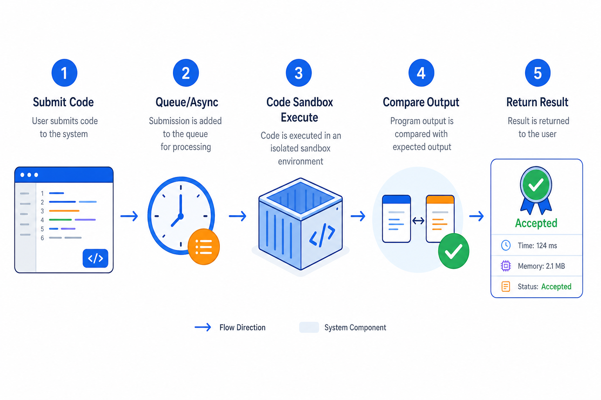
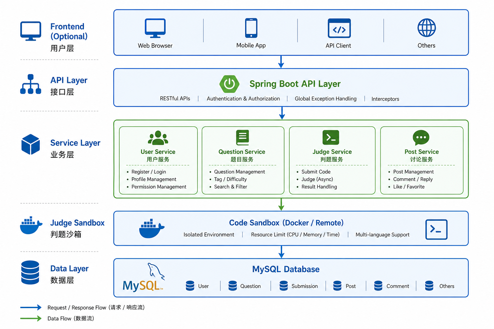
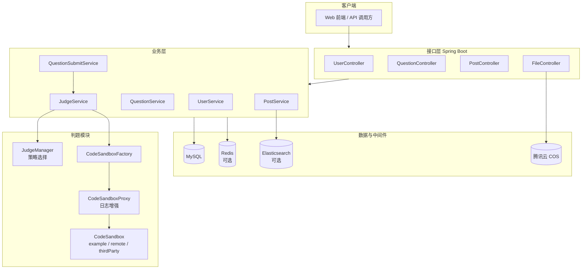
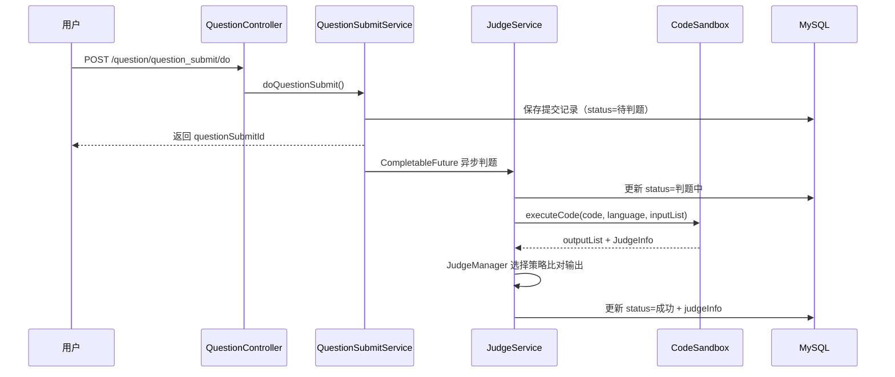
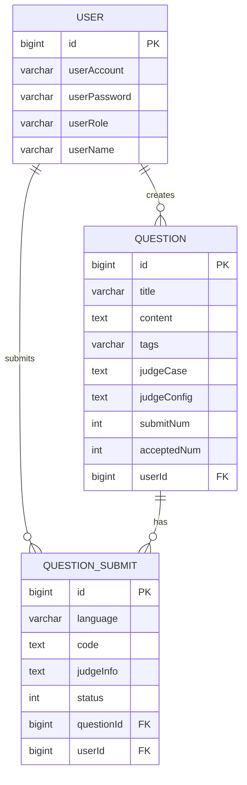

<p align="center">
  
</p>

<p align="center">
  <strong>基于 Spring Boot 的在线判题（OJ）后端系统</strong><br>
  毕业设计项目 · 支持多语言代码提交 · 可扩展代码沙箱 · 社区帖子与搜索
</p>

<p align="center">
  
  
  
  
  
  
</p>

---

## 📖 项目简介

**HTU-OJ** 是一套面向算法练习与编程竞赛场景的 **Online Judge（在线判题）** 后端服务。用户可浏览题目、在线编写并提交代码，系统通过 **代码沙箱** 编译运行后自动比对输出，返回判题结果；同时集成用户管理、帖子社区、文件上传、微信登录等能力，适合作为毕业设计或 OJ 平台的后端基础。

| 模块 | 说明 |
|------|------|
| 🧑‍💻 用户系统 | 注册 / 登录 / 权限控制（user / admin / ban） |
| 📝 题目管理 | 题目 CRUD、标签、判题用例与配置 |
| ⚖️ 在线判题 | 异步判题、策略模式、多沙箱实现 |
| 💬 帖子社区 | 发帖、点赞、收藏、ES 全文检索 |
| 📁 文件服务 | 腾讯云 COS 对象存储 |
| 📱 微信集成 | 公众号 / 开放平台登录 |

---

## ✨ 核心功能

### 1. 在线判题

- 支持 **Java / C++ / Go** 三种编程语言
- 提交后 **异步判题**，状态流转：`待判题 → 判题中 → 成功 / 失败`
- 判题策略可扩展（默认策略 + Java 专属策略）
- 代码沙箱支持三种模式：`example` / `remote` / `thirdParty`

<p align="center">
  
  <br><em>图 1 · 代码提交与判题流程</em>
</p>

### 2. 题目与提交管理

- 管理员创建 / 更新题目，普通用户可编辑自己的题目
- 题目包含：描述、标签、标准答案、判题用例（JSON）、判题配置（时间 / 内存限制）
- 提交记录脱敏：非本人 / 非管理员无法查看他人代码

### 3. 社区与搜索

- 帖子发布、编辑、点赞、收藏
- Elasticsearch 定时同步帖子，支持全文搜索（可选开启）

### 4. 接口文档

集成 **Knife4j**，启动后访问：

```
http://localhost:8101/api/doc.html
```

---

## 🏗 系统架构

<p align="center">
  
  <br><em>图 2 · 系统分层架构示意</em>
</p>



---

## ⚖️ 判题流程详解



**判题模块设计亮点：**

| 设计模式 | 应用位置 | 作用 |
|---------|---------|------|
| 工厂模式 | `CodeSandboxFactory` | 按配置创建不同沙箱实例 |
| 代理模式 | `CodeSandboxProxy` | 增强沙箱调用日志 |
| 策略模式 | `JudgeStrategy` | 按语言切换判题逻辑 |

---

## 🗄 数据库设计



初始化脚本位于 [`sql/bysj.sql`](sql/bysj.sql)，执行后将创建 `bysj` 数据库及核心表。

---

## 📂 项目结构

```
bysj/
├── docs/
│   └── assets/              # README 配图
├── sql/
│   └── bysj.sql             # 数据库初始化脚本
├── src/main/java/com/lppnb/bysj/
│   ├── MainApplication.java # 启动入口
│   ├── annotation/          # 权限注解 @AuthCheck
│   ├── aop/                   # 权限拦截器
│   ├── config/                # 全局配置（CORS、MyBatis-Plus 等）
│   ├── controller/            # REST 接口层
│   ├── judge/                 # 判题核心模块
│   │   ├── codesandbox/       # 代码沙箱（工厂 / 代理 / 实现）
│   │   └── strategy/          # 判题策略
│   ├── model/                 # 实体、DTO、VO、枚举
│   ├── service/               # 业务逻辑层
│   ├── mapper/                # MyBatis Mapper
│   ├── job/                   # 定时任务（ES 同步）
│   ├── wxmp/                  # 微信公众号
│   └── manager/               # COS 等通用管理器
└── src/main/resources/
    ├── application.yml        # 主配置文件
    └── mapper/                # MyBatis XML
```

---

## 🛠 技术栈

| 类别 | 技术 |
|------|------|
| 框架 | Spring Boot 2.7.2、Spring AOP、Spring Session |
| ORM | MyBatis-Plus 3.5.2 |
| 数据库 | MySQL 8 |
| 缓存 | Redis（可选，分布式 Session） |
| 搜索 | Elasticsearch（可选，帖子检索） |
| 接口文档 | Knife4j (OpenAPI 2) |
| 工具库 | Hutool、EasyExcel、Lombok、Apache Commons |
| 对象存储 | 腾讯云 COS |
| 微信 | wx-java-mp / wx-java-open |

---

## 🚀 快速开始

### 环境要求

- JDK 8+
- Maven 3.6+
- MySQL 8.0+
- （可选）Redis 6+、Elasticsearch 7+

### 1. 克隆项目

```bash
git clone https://github.com/kaze985/bysj.git
cd bysj
```

### 2. 初始化数据库

```bash
mysql -u root -p < sql/bysj.sql
```

### 3. 修改配置

编辑 `src/main/resources/application.yml`：

```yaml
spring:
  datasource:
    url: jdbc:mysql://localhost:3306/bysj
    username: root
    password: 你的密码

codesandbox:
  type: remote   # example | remote | thirdParty
```

> 如需启用 Redis Session、Elasticsearch 搜索，请取消 `application.yml` 中对应配置的注释，并移除 `MainApplication` 中对 `RedisAutoConfiguration` 的 exclude。

### 4. 启动项目

```bash
mvn spring-boot:run
```

或在 IDE 中运行 `MainApplication.java`。

### 5. 访问服务

| 服务 | 地址 |
|------|------|
| API 根路径 | http://localhost:8101/api |
| 接口文档 | http://localhost:8101/api/doc.html |

---

## 📡 主要 API 一览

### 用户 `/user`

| 方法 | 路径 | 说明 |
|------|------|------|
| POST | `/user/register` | 用户注册 |
| POST | `/user/login` | 用户登录 |
| GET | `/user/get/login` | 获取当前登录用户 |
| POST | `/user/logout` | 退出登录 |

### 题目 `/question`

| 方法 | 路径 | 说明 |
|------|------|------|
| POST | `/question/add` | 创建题目 |
| GET | `/question/get/vo` | 获取题目（脱敏） |
| POST | `/question/list/page/vo` | 分页查询题目 |
| POST | `/question/question_submit/do` | **提交代码判题** |
| POST | `/question/question_submit/list/page` | 查询提交记录 |

### 帖子 `/post`

| 方法 | 路径 | 说明 |
|------|------|------|
| POST | `/post/add` | 发布帖子 |
| POST | `/post/list/page` | 分页查询帖子 |
| POST | `/post/search` | ES 搜索帖子（需开启 ES） |

> 完整接口请访问 Knife4j 文档页面。

---

## ⚙️ 代码沙箱配置

在 `application.yml` 中通过 `codesandbox.type` 切换沙箱实现：

| 类型 | 类 | 说明 |
|------|-----|------|
| `example` | `ExampleCodeSandbox` | 本地示例沙箱，用于开发调试 |
| `remote` | `RemoteCodeSandbox` | 远程沙箱服务（生产推荐） |
| `thirdParty` | `ThirdPartyCodeSandbox` | 第三方沙箱接入 |

```yaml
codesandbox:
  type: remote
```

---

## 🧪 运行测试

```bash
mvn test
```

---

## 📸 功能预览

> 启动项目后，可通过 Knife4j 文档页体验全部接口。以下为典型使用流程：

```
1. 注册用户 → 登录获取 Session
2. 浏览题目列表 GET /question/list/page/vo
3. 查看题目详情 GET /question/get/vo?id=1
4. 提交代码 POST /question/question_submit/do
5. 轮询提交结果 POST /question/question_submit/list/page
```

<p align="center">
  
  &nbsp;
  
  &nbsp;
  
</p>

---

## 🤝 贡献

欢迎提交 Issue 或 Pull Request 改进本项目。

---

## 📄 License

本项目采用 MIT 协议开源。

---

<p align="center">
  <sub>Made with ❤️ for Graduation Project · HTU-OJ Online Judge System</sub>
</p>
